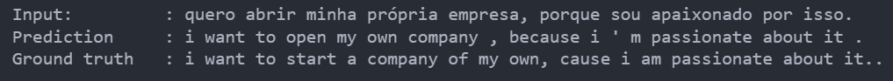
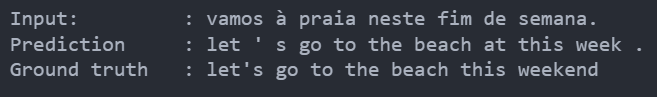

# Transformer for Neural Machine Translation

This project implements a Transformer model for machine translation, specifically translating Portuguese to English using TensorFlow and Keras.

## Overview

The Transformer model architecture, introduced in the paper "[Attention is All You Need](https://arxiv.org/abs/1706.03762)," has been widely adopted in natural language processing tasks, particularly in sequence-to-sequence tasks like machine translation.

This implementation includes:

- Data loading and preprocessing using TensorFlow Datasets (TFDS).
- Tokenization of input and output sequences.
- Positional encoding to inject positional information into the input embeddings.
- Components of the Transformer model, including encoder and decoder layers, attention mechanisms, and feed-forward networks.
- Custom learning rate scheduling based on the original Transformer paper.
- Training loop with masked loss and accuracy metrics.
- Translation capability using the trained model.

## Getting Started

To get started with this project, follow these steps:

1. Clone this repository to your local machine.
2. Run the file `Neural Machine Translation.py` to train the Transformer model on the TED Talks translation dataset.
3. Once the model is trained, you can use the provided translation function to translate Portuguese sentences to English.

## Requirements

- Python 3.x
- TensorFlow 2.x
- TensorFlow Datasets (TFDS)
- NumPy
- Matplotlib (for visualization)

## Sample Output

### Sample Output 1: Example of a line translation from purtuguese to english.

### Sample Output 1: Another example of a line translation from purtuguese to english.
